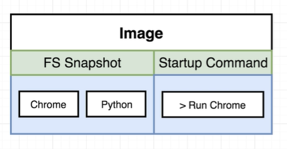
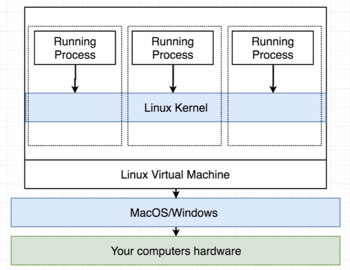
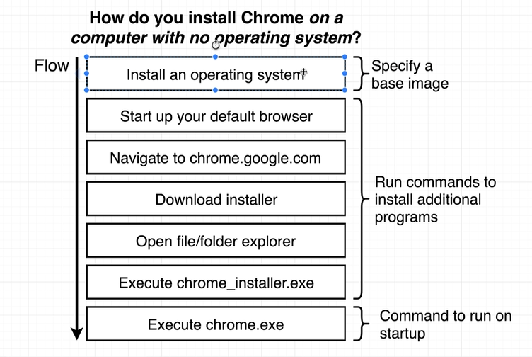
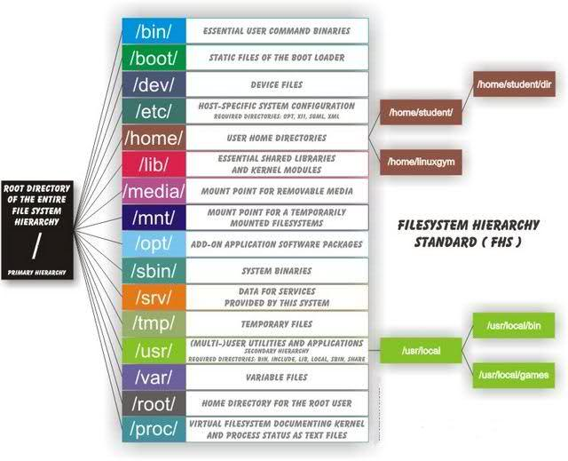
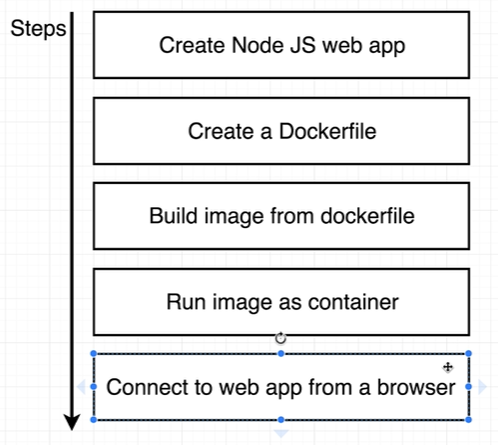

# Docker and Kubernetes: The Complete Guide

This course in on Udemy.com.

<https://www.udemy.com/course/docker-and-kubernetes-the-complete-guide>

How to open diagrams in draw.io. Example for chapter 3.
<https://www.draw.io/?mode=github#HStephenGrider%2FDockerCasts%2Fmaster%2Fdiagrams%2F01%2Fdiagrams.xml>
<https://www.draw.io/?mode=github#HStephenGrider%2FDockerCasts%2Fmaster%2Fdiagrams%2F03%2Fdiagrams.xml>
<https://www.draw.io/?mode=github#HStephenGrider%2FDockerCasts%2Fmaster%2Fdiagrams%2F07%2Fdiagrams.xml>
## Course Information

- Capital 3 - Video 35

## Dive into Docker

### Why Docker

It helps you deploy and run software in a known environment.
It makes it very easy to install and run software.

### What is docker

Docker is a platform or ecosystem around creating and running containers.

Docker Ecosystem:

- Docker Client
- Docker Server
- Docker Machine
- Docker Images
- Docker Hub
- Docker Compose

### Docker Client

1. run "docker run hello-world"
2. Docker Server looks at local image cache for this image
3. If it's not there it goes to Docker Hub
4. If it finds it there the image gets downloaded.
5. Image gets executed

### Container vs Image

A container is a running image in Docker Server. Container in Docker Server
are seperated through Namespaces and Control Groups.
Each image has an Startup Command to define what program needs to be started
when a container is started.

**Namespaces** are used to separate and isolate resources per process or group of processes.

**Control Groups** limit amount of resources used per process.

### Docker Cache

Docker will cache the order and results of building images. It will cache the
different steps to enable faster rebuilds.

**Attention:** If you change command order in a dockerfile the cache can't be used.

### How it runs on your local Windows or MacOS Machine

Docker run = docker create + docker start

Docker create:

Take the filesystem from an image and use it in an harddrive segment on the host.

Docker Start:

Runs start command of container.

### How you can communicate with a running processs in a container

use -it on command allows you to connect to STDIN on running processes in a container and pretty up output.

## Dockerfile

Configuration to define how our container should behave.

### Commands for a Dockerfile

Base syntax
> \<Instruction\> \<argument to the instruction\>

Specify base image
> FROM \<Base image name\>

Set a working directory for building the image and for running the container.
> WORKDIR /usr/app

Prepare custom image
> RUN \<some instructions\>

Setup start command for container
> CMD ["\<start command\>"]

### Workflow to create a Dockerfile

1. Specify baseimage
2. Run some commands to installer additional programs
3. Specify a command to run on container setup

Compared to installing a Chrome on an empty computer.

## Docker Compose

- Seperate CLI that gets installed along with Docker.
- Used to start up multiple Docker containers at the same time.
- Automates some of the long-winded arguments we were passing to 'docker run'

### docker-compose.yml

Run docker-compose.yml file
> docker-compose up

Run docker-compose.yml file in background
> docker-compose up -d

Run docker-compose.yml file and rebuild containers
> docker-compose up --build

Stop container started with docker-compose
> docker-compose down

Get status of running container belong to docker-compose.yml file in same directory.
> docker-compose ps

### Restart policies

Exit code 0 means no error.
Exit code > 0 means error.

## Docker Client command line commands

### Base

get docker version
> docker version

Clear docker. Removes images, containers, networks or build cache
> docker system prune

### Build images

Build an image from a dockerfile in current directory
> docker build .

Build an image from a dockerfile and tag. Tag is version
> docker build -t \<docker id\>/\<repo/project name\>:\<Version\> \<buildcontext\>
> docker build -t alexsnyx/testproject:latest .

Change a running container and create a new image. -c applies a change to a running container.
> docker commit - c 'CMD ["redis-server"]' \<container id\>

### Create to kill containers

Start image with default start command
> docker run \<image name\>

Start image and override start command
> docker run \<image name\> \<some command\>

Start image in background and print container id
> docker run -d \<image name\>

Create a container from an image and returns a container id
> docker create \<image name\>

Create a container from an image, overrides default command and returns a container id
> docker create \<image name\> \<command\>

Start container
> docker run \<container id\>

Start container an forward network traffic from localmachine port to container port
> docker run -p \<localmachine port\>:\< container port\> \<container id\>

Start container and forward container output to current console
> docker start -a \<container id\>

Startup a container and attach a shell after startup.
> docker run -it \<image name\> sh

Stop container.  Sends a SIGTERM to a container and give them some time to clean up.
> docker stop \<container id\>

Stops container immediately. It sends SIGKILL to container.
> docker kill \<container id\>

Remove container
> docker rm \<container id\>

### Interact with running containers

List running containers
> docker ps

List all container ever created
> docker ps --all

Get logs from a container
> docker logs \<container id\>

Execute a command in a running container. -it means connect to STDIN.
> docker exec -it \<container id\> \<command\>

Get access to command line from a container
> docker exec -it \<container id\> sh

### Interact with docker runtime

Connect to docker server shell. (MobyLinuxVM)
> docker run --net=host --ipc=host --uts=host --pid=host -it --security-opt=seccomp=unconfined --privileged --rm alpine /bin/sh

## Linux Directory Structure

<https://www.tecmint.com/linux-directory-structure-and-important-files-paths-explained/>

Each of the above directory (which is a file, at the first place) contains important information, required for booting to device drivers, configuration files, etc. Describing briefly the purpose of each directory, we are starting hierarchically.

- /bin : All the executable binary programs (file) required during booting, repairing, files required to run into single-user-mode, and other important, basic commands viz., cat, du, df, tar, rpm, wc, history, etc.
- /boot : Holds important files during boot-up process, including Linux Kernel.
- /dev : Contains device files for all the hardware devices on the machine e.g., cdrom, cpu, etc
- /etc : Contains Application’s configuration files, startup, shutdown, start, stop script for every individual program.
- /home : Home directory of the users. Every time a new user is created, a directory in the name of user is created within home directory which contains other directories like Desktop, Downloads, Documents, etc.
- /lib : The Lib directory contains kernel modules and shared library images required to boot the system and run commands in root file system.
- /lost+found : This Directory is installed during installation of Linux, useful for recovering -files which may be broken due to unexpected shut-down.
- /media : Temporary mount directory is created for removable devices viz., media/cdrom.
- /mnt : Temporary mount directory for mounting file system.
- /opt : Optional is abbreviated as opt. Contains third party application software. Viz., Java, etc.
- /proc : A virtual and pseudo file-system which contains information about running process with a particular Process-id aka pid.
- /root : This is the home directory of root user and should never be confused with ‘/‘
- /run : This directory is the only clean solution for early-runtime-dir problem.
- /sbin : Contains binary executable programs, required by System Administrator, for Maintenance. -Viz., iptables, fdisk, ifconfig, swapon, reboot, etc.
- /srv : Service is abbreviated as ‘srv‘. This directory contains server specific and service -related files.
- /sys : Modern Linux distributions include a /sys directory as a virtual filesystem, which stores -and allows modification of the devices connected to the system.
- /tmp :System’s Temporary Directory, Accessible by users and root. Stores temporary files for user and system, till next boot.
- /usr : Contains executable binaries, documentation, source code, libraries for second level -program.
- /var : Stands for variable. The contents of this file is expected to grow. This directory contains log, lock, spool, mail and temp files.

## Linux System Files

Linux is a complex system which requires a more complex and efficient way to start, stop, maintain and reboot a system unlike Windows. There is a well defined configuration files, binaries, man pages, info files, etc. for every process in Linux.

- /boot/vmlinuz : The Linux Kernel file.
- /boot/vmlinuz : The Linux Kernel file.
- /dev/hda : Device file for the first IDE HDD (Hard Disk Drive)
- /dev/hdc : Device file for the IDE Cdrom, commonly
- /dev/null : A pseudo device, that don’t exist. Sometime garbage output is redirected to /dev/null, so that it gets lost, forever.
- /etc/bashrc : Contains system defaults and aliases used by bash shell.
- /etc/crontab : A shell script to run specified commands on a predefined time Interval.
- /etc/exports : Information of the file system available on network.
- /etc/fstab : Information of Disk Drive and their mount point.
- /etc/group : Information of Security Group.
- /etc/grub.conf : grub bootloader configuration file.
- /etc/init.d : Service startup Script.
- /etc/lilo.conf : lilo bootloader configuration file.
- /etc/hosts : Information of Ip addresses and corresponding host names.
- /etc/hosts.allow : List of hosts allowed to access services on the local machine.
- /etc/host.deny : List of hosts denied to access services on the local machine.
- /etc/inittab : INIT process and their interaction at various run level.
- /etc/issue : Allows to edit the pre-login message.
- /etc/modules.conf : Configuration files for system modules.
- /etc/motd : motd stands for Message Of The Day, The Message users gets upon login.
- /etc/mtab : Currently mounted blocks information.
- /etc/passwd : Contains password of system users in a shadow file, a security implementation.
- /etc/printcap : Printer Information
- /etc/profile : Bash shell defaults
- /etc/profile.d : Application script, executed after login.
- /etc/rc.d : Information about run level specific script.
- /etc/rc.d/init.d : Run Level Initialisation Script.
- /etc/resolv.conf : Domain Name Servers (DNS) being used by System.
- /etc/securetty : Terminal List, where root login is possible.
- /etc/skel : Script that populates new user home directory.
- /etc/termcap : An ASCII file that defines the behaviour of Terminal, console and printers.
- /etc/X11 : Configuration files of X-window System.
- /usr/bin : Normal user executable commands.
- /usr/bin/X11 : Binaries of X windows System.
- /usr/include : Contains include files used by ‘c‘ program.
- /usr/share : Shared directories of man files, info files, etc.
- /usr/lib : Library files which are required during program compilation.
- /usr/sbin : Commands for Super User, for System Administration.
- /proc/cpuinfo : CPU Information
- /proc/filesystems : File-system Information being used currently.
- /proc/interrupts : Information about the current interrupts being utilised currently.
- /proc/ioports : Contains all the Input/Output addresses used by devices on the server.
- /proc/meminfo : Memory Usages Information.
- /proc/modules : Currently using kernel module.
- /proc/mount : Mounted File-system Information.
- /proc/stat : Detailed Statistics of the current System.
- /proc/swaps : Swap File Information.
- /version : Linux Version Information.
- /var/log/lastlog : log of last boot process.
- /var/log/messages : log of messages produced by syslog daemon at boot.
- /var/log/wtmp : list login time and duration of each user on the system currently.

## Linux command line

exit command line (like ctrl + c)
> ctrl + d

List directory
> ls

Create a new file
> touch \<filename\>

## Node.js sample project

Create a node.js web application. Run it in a container and
access it from browser in hosting environment.

see .\4.Node.js_project folder for project source code

### 